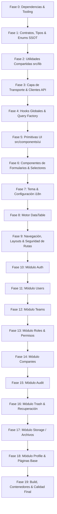

# 🗺️ Roadmap de Revisión y Refactorización Arquitectónica

Este documento define el plan por fases para revisar, sanear y optimizar minuciosamente cada área de la aplicación. Cada fase aborda **una sola parte o capa técnica de forma aislada e integral**, asegurando el cumplimiento estricto de las filosofías de las skills activas:

- **Ponytail (Minimalismo & YAGNI):** La mejor línea de código es la que nunca se escribe. Eliminación de abstracciones especulativas, purgado de dependencias muertas o duplicadas, preferencia por APIs nativas y la biblioteca estándar, mínima complejidad posible y corrección de causas raíz. *No negociable: seguridad, validación de esquemas (Zod) y control explícito de errores.*
- **SRP (Single Responsibility Principle):** Un módulo, clase, hook o función tiene una única razón para cambiar. Separación estricta de capas: Presentación (UI) vs. Aplicación/Lógica (Hooks/Estado) vs. Transporte (Clientes API/Servicios) vs. Contratos (Esquemas). Cero efectos colaterales de presentación en capas de datos.
- **SSOT (Single Source of Truth):** Cada regla de negocio, ruta, clave de caché, estado o constante tiene una única fuente de verdad canónica. Cero cadenas mágicas dispersas, cero estados paralelos duplicados y unificación de contratos y diccionarios de internacionalización.

---

## 🧭 Criterios de Calidad Aplicados en Cada Fase

1. **Checklist Ponytail:**
   - [ ] ¿Esta abstracción o archivo realmente necesita existir o es código especulativo (*YAGNI*)?
   - [ ] ¿Existe ya una utilidad nativa del navegador o de la biblioteca estándar que lo resuelva (ej. `crypto.randomUUID()`, `Intl`)?
   - [ ] ¿Hay dependencias instaladas que no se usan o que duplican funciones (`@mui/*` vs `radix-ui`/`tailwindcss`)?
   - [ ] ¿Se eliminaron `console.log`, código muerto o imports no utilizados?

2. **Checklist SRP-SSOT:**
   - [ ] ¿Cada componente/función tiene una única responsabilidad clara?
   - [ ] ¿Los servicios de red están desacoplados de la manipulación del DOM y de frameworks específicos?
   - [ ] ¿Las rutas, query keys de React Query y estados de entidad derivan de constantes o enums canónicos?
   - [ ] ¿Los contratos de datos residen en esquemas Zod reutilizables sin tipado `any`?

---

## 📋 Fases del Roadmap

---

### Fase 0: Auditoría de Dependencias y Configuración Base
**Foco:** Limpieza de dependencias huérfanas, scripts de ejecución y configuración de compilador.

- **Archivos:**
  - `package.json`
  - `tsconfig.json`
  - `tsconfig.node.json`
  - `vite.config.ts`
  - `.eslintrc.json`
- **Puntos críticos identificados:**
  - Presencia de dependencias no utilizadas de Material-UI y Emotion (`@mui/material`, `@mui/icons-material`, `@emotion/react`, `@emotion/styled`), mientras la UI se construye con Tailwind v4, Lucide y Radix UI.
  - Inconsistencia en extensiones de importación (presencia dispersa de imports con extensión `.js` en archivos `.ts/.tsx`).
- **Tareas:**
  - [ ] Desinstalar librerías no utilizadas (`@mui/material`, `@mui/icons-material`, `@emotion/react`, `@emotion/styled`).
  - [ ] Revisar si `tw-animate-css` o librerías secundarias están duplicando capacidades nativas de Tailwind v4.
  - [ ] Configurar y estandarizar resolución de módulos y reglas de imports en TypeScript y ESLint.
- **Criterio de Aceptación:** `package.json` sin dependencias no referenciadas; `pnpm install` genera un lockfile limpio y ligero.

---

### Fase 1: Capa de Núcleo, Tipos Globales y SSOT de Contratos
**Foco:** Centralización de Enums, esquemas base y eliminación de constantes mágicas.

- **Archivos:**
  - `src/schemas/crud.schema.ts`
  - `src/types/data-table.ts`
  - Nuevos archivos o consolidación en `src/types/` o `src/constants/`
- **Puntos críticos identificados:**
  - Estados de registros (`recordStatusSchema`) y formatos de exportación definidos como literales dispersos sin un Enum de TypeScript canónico.
  - Nombres de colecciones y endpoints sin un catálogo centralizado.
- **Tareas:**
  - [ ] Crear Enums/constantes canónicas para estados de entidad (`RecordStatus`), formatos de exportación (`ExportFormat`) y roles de usuario (`UserRole`).
  - [ ] Asegurar que `crud.schema.ts` sea la única fuente de verdad para paginación, filtros de fecha y auditoría.
  - [ ] Eliminar el uso de `any` en esquemas y tipar de forma estricta los contratos base.
- **Criterio de Aceptación:** Cualquier cambio en un estado o tipo base se refleja automáticamente en toda la app sin alterar cadenas literales manuales.

---

### Fase 2: Utilidades Compartidas y Helpers Nativos (`src/lib/`)
**Foco:** Aplicación del Ponytail Ladder: sustituir librerías externas redundantes por APIs estándar del navegador.

- **Archivos:**
  - `src/lib/id.ts`
  - `src/lib/format.ts`
  - `src/lib/utils.ts`
  - `src/lib/auth-flags.ts`
  - `src/lib/parsers.ts`
  - `src/lib/language.ts`
- **Puntos críticos identificados:**
  - `src/lib/id.ts` utiliza `nanoid` con una estructura de prefijos vacía, cuando `crypto.randomUUID()` es nativo en navegadores y entornos modernos.
  - `src/lib/format.ts` fuerza la localización `'es-ES'` de forma fija, ignorando el idioma activo en i18next.
  - `src/lib/parsers.ts` importa de `nuqs/server` en una aplicación cliente Vite SPA.
- **Tareas:**
  - [ ] Reemplazar la generación de IDs por `crypto.randomUUID()` nativo y evaluar la eliminación de la dependencia `nanoid`.
  - [ ] Hacer que las funciones de formateo de fecha y moneda respeten el locale actual de la aplicación.
  - [ ] Evaluar y sanear el uso de `nuqs` asegurando que no se arrastren dependencias de servidor.
  - [ ] Eliminar extensiones `.js` en imports y exportar funciones con tipado estricto.
- **Criterio de Aceptación:** Cero utilidades sobre-diseñadas; pruebas o tipado limpio sin advertencias.

---

### Fase 3: Capa de Transporte y Servicios Base
**Foco:** Separación estricta de responsabilidades (SRP) en servicios HTTP y cliente de autenticación.

- **Archivos:**
  - `src/config/api.ts`
  - `src/services/crud.service.ts`
  - `src/services/auth.service.ts`
  - `src/config/auth-client.ts`
  - `src/config/react-query.ts`
- **Puntos críticos identificados:**
  - `CrudService.export` realiza manipulación directa del DOM (`document.body.appendChild(link)`, `link.click()`), violando el principio de SRP (la capa de transporte no debe tocar la UI ni el DOM).
  - Inconsistencia arquitectónica: `auth.service.ts` y `crud.service.ts` viven en `src/services/`, mientras otros servicios viven en `src/modules/*/model/`.
- **Tareas:**
  - [ ] Extraer la descarga de archivos (DOM click / blob save) a una utilidad de presentación (`downloadBlob`), manteniendo `CrudService.export` enfocado únicamente en la petición HTTP y retorno de datos.
  - [ ] Unificar la convención de ubicación de servicios en la arquitectura.
  - [ ] Configurar el cliente Axios y QueryClient con manejo homogéneo de errores y reintentos.
- **Criterio de Aceptación:** Los servicios de datos son 100% agnósticos de la UI y no contienen lógica de presentación ni dependencias de DOM.

---

### Fase 4: Hooks Globales y Fábrica de Consultas (`src/hooks/`)
**Foco:** Tipado robusto, eliminación de `any`, supresión de `console.log` y gestión canónica de caché (SSOT).

- **Archivos:**
  - `src/hooks/use-crud.ts`
  - `src/hooks/use-auth.ts`
  - `src/hooks/use-callback-ref.ts`
  - `src/hooks/use-debounced-callback.ts`
  - `src/hooks/use-mobile.ts`
- **Puntos críticos identificados:**
  - `use-auth.ts` contiene múltiples parámetros tipados como `any`, logs de depuración en consola (`console.log('Sesión iniciada')`) y efectos de navegación acoplados (`navigate('/signin')` dentro del hook).
  - Typo de nomenclatura: `useOuthGoogle` en vez de `useOAuthGoogle`.
  - Las claves de invalidación de caché usan strings literales (`['session']`) en lugar de factories de query keys.
- **Tareas:**
  - [ ] Tipar estrictamente todas las entradas y salidas de `use-auth.ts` a partir de esquemas Zod.
  - [ ] Eliminar todos los `console.log` y `console.error` de depuración en hooks.
  - [ ] Implementar un Query Key Factory unificado (SSOT) para invalidaciones y mutaciones en `use-crud.ts` y `use-auth.ts`.
  - [ ] Corregir errores tipográficos (`useOAuthGoogle`).
- **Criterio de Aceptación:** Cero uso de `any`; claves de caché centralizadas y hooks con propósito único.

---

### Fase 5: Primitivas de UI y Componentes Base (`src/components/ui/`)
**Foco:** Auditoría de componentes Radix/Tailwind, eliminación de componentes huérfanos y accesibilidad.

- **Archivos:**
  - Directorio `src/components/ui/*.tsx` (36 archivos de componentes)
- **Puntos críticos identificados:**
  - Elevada cantidad de componentes primitivos copiados (tipo shadcn/ui). Varios podrían no estar utilizándose en ninguna vista real.
  - Componentes como `faceted.tsx` o variantes de botones requieren verificación de uso real (YAGNI).
- **Tareas:**
  - [ ] Realizar inventario de uso de cada componente dentro de `src/components/ui/`.
  - [ ] Eliminar componentes no referenciados ni previstos a corto plazo (regla de oro Ponytail: *borrar antes que mantener*).
  - [ ] Verificar consistencia en estilos y tokens de Tailwind v4 en los componentes que permanezcan.
- **Criterio de Aceptación:** Cada componente en `src/components/ui/` cuenta con al menos un caso de uso real en la aplicación.

---

### Fase 6: Componentes de Formularios y Selectores
**Foco:** Desacoplamiento de traducciones de dominio y tipado estricto en selectores reutilizables.

- **Archivos:**
  - `src/components/form/form-field-wrapper.tsx`
  - `src/components/selector/selector.tsx`
  - `src/components/selector/assignment-drawer.tsx`
  - `src/components/skeleton/form-skeleton.tsx`
- **Puntos críticos identificados:**
  - `assignment-drawer.tsx` utiliza `useGetList: (params: any) => ...` (pérdida de tipado).
  - `assignment-drawer.tsx` (un componente genérico) tiene acoplada la clave de traducción de un módulo específico: `{t('teams.cancel', ...)}`.
- **Tareas:**
  - [ ] Sustituir `any` por tipos genéricos seguros en `SelectorConfig`.
  - [ ] Parametrizar o desacoplar etiquetas de traducción específicas de módulos en componentes compartidos.
  - [ ] Asegurar que `FormFieldWrapper` gestione accesibilidad ARIA e invalidación de forma homogénea.
- **Criterio de Aceptación:** Componentes genéricos 100% reutilizables y desacoplados de dominios concretos.

---

### Fase 7: Componentes de Soporte: Tema e Internacionalización
**Foco:** Consistencia en la persistencia de tema y configuración centralizada de i18n.

- **Archivos:**
  - `src/components/theme/theme-provider.tsx`
  - `src/components/theme/mode-toggle.tsx`
  - `src/components/language/language-switcher.tsx`
  - `src/config/i18n.ts`
  - `public/locales/{es,en}/translation.json`
- **Puntos críticos identificados:**
  - Existencia de traducciones dispersas en componentes mientras existe un sistema central de traducción.
  - Sincronización entre las opciones disponibles de idioma y los archivos cargados.
- **Tareas:**
  - [ ] Verificar que `theme-provider` respete preferencias de sistema y persistencia limpia en `localStorage`.
  - [ ] Consolidar la lista de idiomas admitidos como un Enum o lista constante de solo lectura.
  - [ ] Asegurar que el cambio de idioma actualice dinámicamente fechas y tablas.
- **Criterio de Aceptación:** Cambio fluido de tema claro/oscuro e idioma sin fugas de texto no traducido.

---

### Fase 8: Motor Avanzado de Data-Table
**Foco:** Unificación de la internacionalización (SSOT), simplificación de filtros y optimización de renderizado.

- **Archivos:**
  - `src/components/data-table/*.tsx` (21 archivos)
  - `src/config/data-table.ts`
- **Puntos críticos identificados:**
  - `data-table-i18n.tsx` implementa un React Context paralelo (`DataTableI18nContext`) con textos en español e inglés mezclados, duplicando el sistema oficial `react-i18next`.
  - `dataTableConfig` contiene operadores y etiquetas en inglés hardcodeadas.
  - Complejidad alta en `data-table-filter-list.tsx` y `data-table-filter-menu.tsx` que dependen de `@dnd-kit`.
- **Tareas:**
  - [ ] Eliminar `DataTableI18nContext` e integrar los textos de las tablas directamente en `public/locales` a través de `useTranslation` (SSOT).
  - [ ] Evaluar si la ordenación drag-and-drop de filtros con `@dnd-kit` aporta valor suficiente o si una lista estándar simplifica drásticamente el código (Ponytail).
  - [ ] Tipar estrictamente operadores y filtros reduciendo código redundante.
- **Criterio de Aceptación:** Una única fuente de verdad para i18n en tablas; reducción de líneas de código y rendimiento fluido en paginación/filtrado.

---

### Fase 9: Navegación, Layouts y Seguridad de Rutas
**Foco:** Eliminación de código duplicado en layouts y corrección crítica del control de acceso RBAC.

- **Archivos:**
  - `src/components/layout/admin-layout.tsx`
  - `src/components/layout/private-layout.tsx`
  - `src/components/layout/public-layout.tsx`
  - `src/components/layout/sidebar-routes.ts`
  - `src/components/routes/admin-route.tsx`
  - `src/components/routes/protected-route.tsx`
  - `src/components/routes/guest-route.tsx`
  - `src/router.tsx`
- **Puntos críticos identificados:**
  - **Fallo de seguridad:** `AdminRoute` no valida el rol de administrador; es una copia idéntica de `ProtectedRoute` y permite el acceso a rutas protegidas administrativas a cualquier usuario autenticado.
  - **Duplicación casi total:** `AdminLayout` y `PrivateLayout` son idénticos en un 99%, diferenciándose únicamente en el componente de barra lateral (`sidebar-admin` vs `sidebar-common`).
  - En `router.tsx`, la ruta `/documents` carga `RecoveryView` en lugar de una vista de documentos.
- **Tareas:**
  - [ ] Implementar la comprobación de rol administrativo en `AdminRoute` basada en la sesión del usuario.
  - [ ] Unificar `AdminLayout` y `PrivateLayout` en un único componente base reutilizable parametrizado por la navegación correspondiente.
  - [ ] Corregir el mapeo de `/documents` en el router hacia el componente adecuado.
  - [ ] Definir las rutas y permisos en constantes canónicas para evitar strings dispersos.
- **Criterio de Aceptación:** Rutas administrativas efectivamente restringidas a roles con permisos; layouts unificados sin duplicación de código.

---

### Fase 10: Módulo de Autenticación (`src/modules/auth/`)
**Foco:** Validación de esquemas, flujos de sesión, robustez en recuperación y registro.

- **Archivos:**
  - `src/modules/auth/pages/sign-in.tsx`
  - `src/modules/auth/pages/sign-up.tsx`
  - `src/modules/auth/pages/forgot-password.tsx`
  - `src/modules/auth/pages/reset-password.tsx`
  - `src/modules/auth/pages/verify-email.tsx`
  - `src/modules/auth/components/oauth-button.tsx`
  - `src/modules/auth/model/auth.schema.ts`
- **Puntos críticos identificados:**
  - Cohesión entre los esquemas de validación Zod y las respuestas de error devueltas por Better Auth.
  - Manejo de estados de carga y feedback accesible al usuario (toasts/alertas).
- **Tareas:**
  - [ ] Unificar y validar los esquemas en `auth.schema.ts` (contraseñas, confirmaciones, tokens).
  - [ ] Asegurar que los formularios utilicen `React Hook Form` con resolver de Zod sin lógica duplicada.
  - [ ] Probar y blindar los flujos de redirección tras login/logout.
- **Criterio de Aceptación:** Flujo de autenticación seguro, validaciones de contraseña sólidas y UX consistente.

---

### Fase 11: Módulo de Usuarios (`src/modules/users/`)
**Foco:** Gestión completa de usuarios, asignación de roles/equipos y tablas relacionales.

- **Archivos:**
  - `src/modules/users/pages/users-view.tsx`
  - `src/modules/users/pages/users-detail.tsx`
  - `src/modules/users/components/users-table.tsx`
  - `src/modules/users/components/users-form.tsx`
  - `src/modules/users/components/users-roles-table.tsx`
  - `src/modules/users/components/users-teams-table.tsx`
  - `src/modules/users/model/*`
- **Puntos críticos identificados:**
  - Verificar coherencia entre los hooks de consulta de usuarios (`use-users-table.ts`, `use-users-detail.ts`) y la invalidación de caché en mutaciones.
- **Tareas:**
  - [ ] Auditar `users.schema.ts` para asegurar que el modelo refleje la API backend sin campos superfluos.
  - [ ] Refactorizar tablas de asignación de roles y equipos para reutilizar componentes comunes.
  - [ ] Verificar que la creación y edición manejen soft-delete y restauración correctamente.
- **Criterio de Aceptación:** CRUD de usuarios completo, validado y con sincronización instantánea de caché.

---

### Fase 12: Módulo de Equipos / Teams (`src/modules/teams/`)
**Foco:** Gestión de membresías, roles de equipo y detalle organizacional.

- **Archivos:**
  - `src/modules/teams/pages/teams-view.tsx`
  - `src/modules/teams/pages/teams-detail.tsx`
  - `src/modules/teams/components/teams-table.tsx`
  - `src/modules/teams/components/teams-form.tsx`
  - `src/modules/teams/components/members-table.tsx`
  - `src/modules/teams/components/add-member.tsx`
  - `src/modules/teams/components/teams-roles-table.tsx`
  - `src/modules/teams/model/*`
- **Puntos críticos identificados:**
  - Comprobar la gestión de asignación y desasignación de miembros (evitar llamadas redundantes y estados en desincronía).
- **Tareas:**
  - [ ] Asegurar tipado estricto en la selección de nuevos miembros (`add-member.tsx`).
  - [ ] Validar que los permisos por equipo se mantengan aislados y no interfieran con roles globales.
  - [ ] Simplificar lógica de estados en formularios de detalle.
- **Criterio de Aceptación:** Flujo de miembros y roles de equipo operativo, sin duplicidad de datos en memoria.

---

### Fase 13: Módulo de Roles, Permisos y Módulos de Sistema
**Foco:** Resolución de la duplicidad arquitectónica `src/modules/modules/` y matriz de permisos.

- **Archivos:**
  - `src/modules/roles/pages/*`
  - `src/modules/roles/components/role-permissions-matrix.tsx`
  - `src/modules/roles/components/role-assignments-table.tsx`
  - `src/modules/roles/components/roles-table.tsx`
  - `src/modules/roles/components/roles-form.tsx`
  - `src/modules/roles/model/*`
  - `src/modules/modules/*` (módulos dinámicos de sistema)
- **Puntos críticos identificados:**
  - Carpeta con nombre duplicado confuso: `src/modules/modules/` (gestiona los módulos/entidades registradas para la matriz de permisos).
  - La matriz de permisos (`role-permissions-matrix.tsx`) puede volverse un cuello de botella de rendimiento si gestiona estado local complejo sin memoización adecuada.
- **Tareas:**
  - [ ] Renombrar o reorganizar `src/modules/modules/` a una nomenclatura inequívoca (ej. `system-modules` o integrarlo dentro de `roles/permissions`).
  - [ ] Optimizar la matriz de permisos para actualizar selecciones por lotes de forma limpia.
  - [ ] Homogeneizar esquemas de permisos entre front y contratos backend.
- **Criterio de Aceptación:** Estructura de carpetas limpia y comprensible; matriz de permisos reactiva y tipada.

---

### Fase 14: Módulo de Empresas / Organizaciones (`src/modules/companies/`)
**Foco:** Gestión multi-empresa, datos fiscales y documentos vinculados.

- **Archivos:**
  - `src/modules/companies/pages/companies-view.tsx`
  - `src/modules/companies/pages/companies-detail.tsx`
  - `src/modules/companies/components/companies-table.tsx`
  - `src/modules/companies/components/companies-form.tsx`
  - `src/modules/companies/model/*`
- **Puntos críticos identificados:**
  - En `companies-detail.tsx` se integra directamente `DocumentsTable` y `FileUploadButton` importados de `features/storage`.
- **Tareas:**
  - [ ] Validar esquemas de datos corporativos (identificadores fiscales, direcciones).
  - [ ] Verificar la correcta vinculación polimórfica de documentos (`entityType="companies"`, `entityId`).
  - [ ] Limpiar código duplicado entre la creación y edición.
- **Criterio de Aceptación:** Módulo de empresas robusto, con gestión documental integrada y fluida.

---

### Fase 15: Módulo de Auditoría (`src/modules/audit/`)
**Foco:** Registro inmutable de eventos, trazabilidad y visor detallado de logs.

- **Archivos:**
  - `src/modules/audit/pages/audit-view.tsx`
  - `src/modules/audit/pages/audit-detail.tsx`
  - `src/modules/audit/components/audit-table.tsx`
  - `src/modules/audit/model/*`
- **Puntos críticos identificados:**
  - Este módulo es estrictamente de solo lectura (no debe permitir mutaciones directas ni borrado arbitrario desde el front).
  - El visor de detalles (`audit-detail.tsx`) debe renderizar cambios diferenciales (diff o payload JSON) de manera limpia y legible.
- **Tareas:**
  - [ ] Garantizar que los servicios y hooks de auditoría no expongan métodos de mutación innecesarios (YAGNI).
  - [ ] Optimizar la visualización de metadatos y payloads de eventos en el detalle.
  - [ ] Añadir filtros eficientes por fecha, usuario y entidad auditada.
- **Criterio de Aceptación:** Trazabilidad clara de cambios en el sistema con carga optimizada y navegación cómoda.

---

### Fase 16: Módulo de Papelera y Recuperación (`src/modules/trash/`)
**Foco:** Refactorización de servicios sucios, eliminación de mapeos manuales y recuperación de datos.

- **Archivos:**
  - `src/modules/trash/pages/recovery-view.tsx`
  - `src/modules/trash/components/entities-trash-table.tsx`
  - `src/modules/trash/components/documents-trash-table.tsx`
  - `src/modules/trash/model/trash.service.ts`
  - `src/modules/trash/model/trash.schema.ts`
  - `src/modules/trash/model/use-trash-table.ts`
- **Puntos críticos identificados:**
  - `trash.service.ts` contiene múltiples mapeos manuales de snake_case a camelCase con uso excesivo de `any` y encadenamientos de respaldo (`item.module_id ?? item.moduleId ?? item.id`).
  - La vista `recovery-view.tsx` asume de forma ambigua la ruta `/documents`.
- **Tareas:**
  - [ ] Refactorizar `trash.service.ts` usando Zod para el parseo y transformación automática de respuestas en lugar de asignaciones manuales con `any`.
  - [ ] Separar limpiamente la vista de papelera general de la vista de documentos eliminados.
  - [ ] Verificar las acciones en lote (restauración múltiple y purgado permanente).
- **Criterio de Aceptación:** Servicio de papelera limpio, tipado y predecible; operaciones bulk seguras con confirmaciones.

---

### Fase 17: Módulo de Almacenamiento y Archivos (`src/features/storage/`)
**Foco:** Unificación arquitectónica bajo el estándar de módulos, subida de archivos y validación.

- **Archivos:**
  - `src/features/storage/components/file-upload-button.tsx`
  - `src/features/storage/components/file-upload-zone.tsx`
  - `src/features/storage/components/storage-table.tsx`
  - `src/features/storage/model/*`
  - `src/schemas/storage.schema.ts`
- **Puntos críticos identificados:**
  - `storage` es el único dominio alojado en `src/features/`, mientras el resto de la aplicación utiliza `src/modules/`.
  - Debe validarse el manejo de drag & drop, límites de tamaño y tipos MIME permitidos tanto en cliente como en contrato de subida.
- **Tareas:**
  - [ ] Reubicar `src/features/storage/` a `src/modules/storage/` para unificar la arquitectura global del proyecto (SSOT estructural).
  - [ ] Consolidar los esquemas de subida en el módulo correspondiente.
  - [ ] Validar que `FileUploadZone` y `FileUploadButton` manejen estados de progreso y errores de red de forma clara.
- **Criterio de Aceptación:** Arquitectura homogénea en `src/modules/`; subida de ficheros confiable con validación preventiva de tipos y tamaños.

---

### Fase 18: Perfil de Usuario y Páginas Generales (`src/modules/profile/`, `src/pages/`)
**Foco:** Eliminación de código duplicado en formularios de contraseña y saneamiento de vistas huérfanas.

- **Archivos:**
  - `src/modules/profile/profile-page.tsx`
  - `src/pages/Home.tsx`
  - `src/pages/Admin.tsx`
- **Puntos críticos identificados:**
  - `profile-page.tsx` tiene campos de contraseñas idénticos repetidos 3 veces con su propio estado de visibilidad, además de contener errores tipográficos como `form id="form-signin"`.
  - `Home.tsx` y `Admin.tsx` son actualmente marcadores de posición minimalistas que retornan texto plano.
- **Tareas:**
  - [ ] Extraer un componente de campo de contraseña reutilizable para evitar duplicar 50 líneas de JSX por cada campo.
  - [ ] Corregir identificadores y etiquetas en el formulario de perfil.
  - [ ] Dotar a `Home.tsx` y `Admin.tsx` de contenido de bienvenida/dashboard inicial coherente o conectarlos adecuadamente.
- **Criterio de Aceptación:** Formulario de perfil limpio y modular; páginas principales consistentes con el diseño de la app.

---

### Fase 19: Build, Contenedores, Calidad y Verificación Final
**Foco:** Certificación de cero errores en el bundle, optimización de assets y comprobación de despliegue.

- **Archivos:**
  - `vite.config.ts`
  - `dockerfile`
  - `docker-compose.yml`
  - `nginx.conf`
  - `vercel.json`
- **Puntos críticos identificados:**
  - Validar que el bundle final de Vite no contenga dependencias obsoletas ni fugas de memoria.
  - Asegurar que la configuración de Nginx y Docker exponga la SPA con rutas gestionadas correctamente (fallback a `index.html`).
- **Tareas:**
  - [ ] Ejecutar `pnpm typecheck` asegurando cero errores de compilación TypeScript.
  - [ ] Ejecutar `pnpm lint` asegurando cero advertencias o reglas rotas de formateo.
  - [ ] Ejecutar `pnpm build` y analizar el tamaño del bundle (`dist/`).
  - [ ] Comprobar la construcción y arranque del contenedor Docker (`docker-compose up`).
- **Criterio de Aceptación:** Build de producción sin fallos, bundle optimizado y contenedor funcional listo para despliegue.

---

## 📊 Matriz de Seguimiento del Progreso

| Fase | Área / Componente | Foco Principal | Estado |
| :--- | :--- | :--- | :---: |
| **0** | Dependencias y Configuración Base | Ponytail (Limpieza de bloat) | ⏳ Pendiente |
| **1** | Núcleo, Tipos y Enums SSOT | SSOT (Centralización de contratos) | ⏳ Pendiente |
| **2** | Utilidades Compartidas (`src/lib`) | Ponytail / Stdlib nativa | ⏳ Pendiente |
| **3** | Capa de Transporte y Servicios Base | SRP (Desacoplar de DOM) | ⏳ Pendiente |
| **4** | Hooks Globales y Query Factory | SRP & SSOT (Caché y tipado) | ⏳ Pendiente |
| **5** | Primitivas UI (`src/components/ui`) | Ponytail (Auditoría de uso) | ⏳ Pendiente |
| **6** | Formularios y Selectores | SRP (Desacoplamiento) | ⏳ Pendiente |
| **7** | Tema e Internacionalización | SSOT (Persistencia e i18n) | ⏳ Pendiente |
| **8** | Motor Avanzado de Data-Table | SSOT & Ponytail (Simplificar filtros e i18n) | ⏳ Pendiente |
| **9** | Navegación, Layouts y Rutas | Security & SRP (Fix AdminRoute & DRY) | ⏳ Pendiente |
| **10** | Módulo Auth | Security & SRP | ⏳ Pendiente |
| **11** | Módulo Users | SRP & SSOT | ⏳ Pendiente |
| **12** | Módulo Teams | SRP & SSOT | ⏳ Pendiente |
| **13** | Módulo Roles y Módulos de Sistema | Ponytail & SSOT (Estructura limpia) | ⏳ Pendiente |
| **14** | Módulo Companies | SRP & Cohesión | ⏳ Pendiente |
| **15** | Módulo Audit | SRP & Inmutabilidad | ⏳ Pendiente |
| **16** | Módulo Trash y Recuperación | Ponytail & Zod (Limpieza de servicios) | ⏳ Pendiente |
| **17** | Módulo Storage / Archivos | Cohesión Arquitectónica | ⏳ Pendiente |
| **18** | Perfil y Páginas Generales | Ponytail & DRY | ⏳ Pendiente |
| **19** | Build, Docker y Calidad Final | Verificación Integral | ⏳ Pendiente |

## ⚡ Roadmap Paralelo: Tareas Asíncronas (Jobs) & Tiempo Real (SSE)

Este plan sincroniza la evolución del módulo de **Tareas Asíncronas (`jobs`)** en el Frontend con las fases del Backend:

| Hito | Backend | Frontend | Estado |
| :--- | :--- | :--- | :---: |
| **Jobs v1 (CRUD & Ejecución)** | Endpoints `/api/jobs`, `/cancel`, `/retry` | Vistas `/admin/jobs` y `/admin/jobs/:id`, tabla con filtros, polling condicional suave a 4s (sin parpadeos) y diálogos unificados | 🚀 En ejecución |
| **Jobs v2 (Trazabilidad)** | Auditoría automática de cambios de estado en jobs | Pestaña "Historial de Auditoría" en detalle de Job incrustando `AuditTable moduleSlug="jobs" entityId={id}` | ⏳ Fase 2 |
| **Fase 7 Backend (Real-Time & SSE)** | Stream SSE `/api/events/jobs` o sistema unificado de notificaciones push | Eliminación del polling temporal en cliente; suscripción nativa vía hook `useJobEvents` (EventSource) para actualizaciones instantáneas | 📅 Planificado (Fase 7) |

---
*Roadmap generado conforme a las directrices de las skills `ponytail` y `srp-ssot`.*
